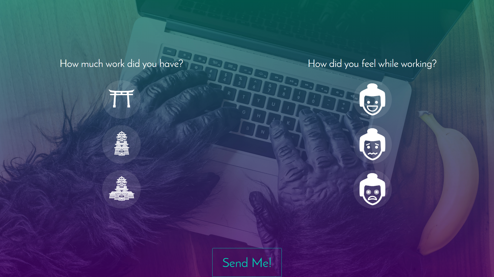

# Feeling Meter

> Vue.js + NetCore Project to make a Feelings Meter
> Vue.js is used for the Frontend part and NETCore for the API

## Project Overview



## Build Setup

> Database information is located in the appsettings.json (Backend)

> Data to Change: serverName, username, password in the AzureDB connectionString

> API Url is located in the routes.js file in the Frontend. The file is located in src/data

``` bash
# install dependencies
npm install

# serve with hot reload at localhost:8080
npm run dev

# build for production with minification
npm run build

# build for production and view the bundle analyzer report
npm run build --report
```
